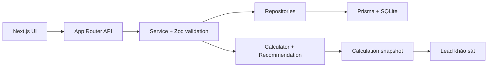

# Solar Team — Solar Calculator MVP

Công cụ tiếng Việt giúp hộ gia đình ước tính gói điện mặt trời phù hợp từ tiền
điện, khu vực, mức dùng điện ban ngày, diện tích mái và nhu cầu điện dự phòng.
Ứng dụng trả kết quả tiết kiệm, hóa đơn còn lại, thời gian hoàn vốn, so sánh gói
và tiếp nhận đăng ký khảo sát.

> **Trạng thái:** MVP chức năng cũ đã hoàn thành qua Giai đoạn 9. Khung kỹ thuật
> Giai đoạn 0, Giai đoạn 1 và phần kỹ thuật biểu giá/VAT Giai đoạn 2 của roadmap
> độ chính xác đã được triển khai; usability, phê duyệt biểu giá/VAT và đối
> soát hóa đơn thật vẫn chưa hoàn tất. Dữ liệu package,
> thiết bị, hệ số tỉnh và thông tin doanh nghiệp vẫn là `DEMO`. Không sử dụng kết
> quả để cam kết thương mại trước khi nhập dữ liệu thật và nghiệm thu theo
> [hướng dẫn dữ liệu](docs/DATA-ONBOARDING.md).
>
> Các giai đoạn tiếp theo chỉ tập trung vào trải nghiệm và độ chính xác dành cho
> khách hàng; phần quản trị hiện có được giữ nguyên nhưng không tiếp tục mở rộng.

## Tính năng

- Registry biểu giá có phiên bản: 6 bậc QD1279 hiện hành; candidate 5 bậc QD14
  bị khóa cho đến khi có quyết định giá hiệu lực.
- Nhập trực tiếp 1–12 tháng kWh, giữ lịch sử và provenance trong snapshot.
- Biểu mẫu ba bước có xác nhận, hỗ trợ mái chưa biết và tải dự phòng có điều kiện.
- Suy ngược tổng thanh toán qua tariff/VAT theo kỳ; tách khoản khác, hỗ trợ nhiều
  hộ/kỳ đổi ngày và trả khoảng kWh khi khách không chắc thành phần hóa đơn.
- Tính sản lượng, điện tự dùng, điện dư, hóa đơn còn lại và hoàn vốn.
- Ba kịch bản sản lượng: thận trọng, tiêu chuẩn và thuận lợi.
- Lọc gói theo diện tích mái, loại hệ thống và nhu cầu dự phòng.
- Xếp hạng và so sánh tối đa ba gói.
- Biểu đồ dòng tiền 0–20 năm và tiết kiệm 5/10/20 năm.
- Form đăng ký khảo sát liên kết với snapshot kết quả tính toán.
- Snapshot bất biến có algorithm/data version, content hash, provenance và
  confidence; production từ chối dữ liệu chưa được xác minh.
- Trang quản trị package, tỉnh/thành, cấu hình tính toán và lead.
- Session quản trị ký HMAC, giới hạn đăng nhập sai và bảo vệ mutation theo origin.
- Validation Zod, TypeScript strict, unit/integration/UI tests.

## Quick start

### Yêu cầu

- Node.js `>= 22.12.0`
- npm

### Cài đặt

```bash
git clone https://github.com/khongmanhpro/solar_2026.git
cd solar_2026
npm install
cp .env.example .env
npm run db:migrate
npm run db:seed
npm run dev
```

Mở:

- Công cụ khách hàng: <http://localhost:3000>
- Đăng nhập quản trị: <http://localhost:3000/admin/login>

Thông tin đăng nhập local mặc định lấy từ `.env`. Hãy đổi toàn bộ credential và
session secret trước khi chạy trên môi trường thật.

## Chạy bằng Docker

Yêu cầu: [Docker](https://docs.docker.com/engine/install/) và
[Docker Compose](https://docs.docker.com/compose/install/).

### Chuẩn bị

```bash
git clone https://github.com/khongmanhpro/solar_2026.git
cd solar_2026
cp .env.example .env
# Sửa .env: ADMIN_PASSWORD, ADMIN_SESSION_SECRET, NEXT_PUBLIC_APP_URL
```

### Build và chạy

```bash
# Build image
docker compose build

# Khởi động dịch vụ (port 3000)
docker compose up -d

# Nạp dữ liệu mẫu (chỉ chạy một lần đầu hoặc khi cần reset dữ liệu demo)
docker compose run --rm seed
```

Sau đó mở:

- Công cụ khách hàng: <http://localhost:3000>
- Đăng nhập quản trị: <http://localhost:3000/admin/login>

### Cập nhật sau này

```bash
git pull origin main
docker compose build
docker compose run --rm app node node_modules/prisma/build/index.js migrate deploy
docker compose up -d
```

### Lưu ý với SQLite

`docker-compose.yml` mount thư mục `./data` trên host vào `/data` trong
container để giữ file `dev.db` khi container bị xóa. File database không được
git commit vì đã có trong `.gitignore`. Trên VPS, hãy backup định kỳ thư mục
`data/`.

### Chạy trên VPS với domain

Thay `NEXT_PUBLIC_APP_URL` trong `.env` thành domain thật, ví dụ:

```env
NEXT_PUBLIC_APP_URL=https://solar.example.com
```

Sau đó chạy `docker compose build` và `docker compose up -d`. Nginx hoặc bất kỳ
reverse proxy nào chỉ cần forward đến `http://localhost:3000`.

## Biến môi trường

| Biến | Bắt buộc | Mô tả |
| --- | --- | --- |
| `DATABASE_URL` | Có | Kết nối Prisma; local dùng `file:./dev.db` |
| `ADMIN_USERNAME` | Có | Tài khoản đăng nhập quản trị |
| `ADMIN_PASSWORD` | Có | Mật khẩu quản trị; không dùng giá trị ví dụ ở production |
| `ADMIN_SESSION_SECRET` | Production | Khóa ký session, tối thiểu 32 ký tự ngẫu nhiên |
| `NEXT_PUBLIC_APP_URL` | Có | URL công khai của ứng dụng |
| `CALCULATION_RETENTION_DAYS` | Không | Số ngày giữ calculation chưa gửi lead; mặc định `30`, chỉ nhận `1..365` |

Không commit `.env`, database SQLite local, file khóa, build output hoặc dữ liệu
khách hàng. Các nhóm file này đã được khai báo trong `.gitignore`.

## Lệnh thường dùng

```bash
npm run dev          # chạy development server
npm run lint         # ESLint
npm run type-check   # TypeScript không phát sinh output
npm run test:run     # chạy toàn bộ test một lần
npm run build        # production build
npm run start        # chạy production build
npm run db:generate  # sinh Prisma Client
npm run db:migrate   # tạo/áp dụng migration local
npm run db:seed      # nạp dữ liệu mẫu
npm run db:studio    # mở Prisma Studio
npm run privacy:purge-calculations # xóa calculation quá hạn chưa có lead
```

## Kiến trúc



Các lớp chính:

- `src/components/calculator`: form, kết quả, biểu đồ, so sánh và lead form.
- `src/lib`: business logic thuần TypeScript, không phụ thuộc React hoặc HTTP.
- `src/server`: authentication, services, repositories và chuẩn hóa lỗi API.
- `src/app/api`: route handlers mỏng, chuyển dữ liệu cho service.
- `prisma`: schema, migration và seed.
- `tests`: validation, calculator, recommendation, API security, service và UI.

Luồng tính toán chi tiết được mô tả trong
[docs/CALCULATION.md](docs/CALCULATION.md). Danh sách endpoint nằm tại
[docs/API.md](docs/API.md).

Ý nghĩa đầu vào, nguồn dữ liệu, confidence, snapshot và cổng chặn dữ liệu demo
được chốt tại
[hợp đồng dữ liệu Giai đoạn 0](docs/PHASE-0-DATA-CONTRACT.md).
Luồng đầu vào tối giản và ranh giới tổng tiền/OCR được mô tả tại
[đầu vào khách hàng Giai đoạn 1](docs/PHASE-1-CUSTOMER-INPUT.md). Registry,
nguồn pháp lý và cổng duyệt nằm tại
[biểu giá/VAT Giai đoạn 2](docs/PHASE-2-TARIFF-ENGINE.md). Phạm vi dữ liệu được
lưu và quy tắc xóa calculation chưa gửi liên hệ nằm tại
[chính sách dữ liệu khách hàng](docs/CUSTOMER-DATA-RETENTION.md).

## Database và seed

Database local sử dụng SQLite. Sau khi clone lần đầu:

```bash
npm run db:migrate
npm run db:seed
```

Seed hiện tạo:

- 4 gói điện mặt trời mẫu.
- 8 hệ số tỉnh/thành mẫu.
- 1 bộ cấu hình tính toán mặc định.

Các giá trị seed chỉ phục vụ phát triển và kiểm thử. Trang quản trị cho phép sửa
package, settings và hệ số tỉnh mà không thay đổi source code.

## Dữ liệu thật và mẫu Excel

Mẫu thu thập dữ liệu nhà cung cấp được lưu tại:

`docs/templates/Mau-thu-thap-du-lieu-dien-mat-troi.xlsx`

File gồm thông tin doanh nghiệp, gói sản phẩm, thiết bị, sản lượng khu vực, biểu
giá, giả định tài chính, quy tắc đề xuất, hóa đơn mẫu và ca nghiệm thu. Quy trình
đưa dữ liệu vào production xem tại [docs/DATA-ONBOARDING.md](docs/DATA-ONBOARDING.md).

## Quản trị

Sau khi đăng nhập, quản trị viên có thể:

- Thêm, sửa, sắp xếp và vô hiệu hóa package.
- Cập nhật cấu hình tính toán và thông tin hotline/Zalo.
- Quản lý hệ số tỉnh/thành.
- Xem lead, snapshot calculation và cập nhật trạng thái bán hàng.

Package đã được calculation tham chiếu không bị xóa cứng; hệ thống chuyển sang
`active=false` để bảo toàn lịch sử.

## API

Response thành công:

```json
{
  "success": true,
  "data": {}
}
```

Response lỗi:

```json
{
  "error": {
    "code": "VALIDATION_ERROR",
    "message": "Dữ liệu không hợp lệ.",
    "issues": []
  }
}
```

Xem toàn bộ route và status code tại [docs/API.md](docs/API.md).

## Kiểm tra chất lượng

Trước khi tạo pull request hoặc deploy:

```bash
npm run lint
npm run type-check
npm run test:run
npm run build
```

Test hiện bao phủ:

- Biên biểu giá và phép suy ngược tiền điện–kWh.
- Calculator, pin lưu trữ, ba kịch bản và dòng tiền.
- Lọc/xếp hạng package.
- Validation input và số điện thoại Việt Nam.
- Service, quan hệ calculation–lead và thao tác admin.
- Bảo mật API/session và luồng giao diện chính.

## Giới hạn hiện tại

- Chỉ hỗ trợ điện sinh hoạt hộ gia đình.
- Nhập kWh hoạt động trực tiếp. Tổng tiền hoạt động trong development/test với
  nhãn dữ liệu chưa duyệt; production tiếp tục chặn đến khi biểu giá, VAT, quy
  tắc làm tròn và hóa đơn tham chiếu được người phụ trách phê duyệt.
- Sản lượng đang dùng `sản lượng nền × hệ số tỉnh`, chưa mô phỏng theo tọa độ,
  hướng mái, góc nghiêng, bóng che hoặc từng tháng.
- Phụ tải ban ngày dùng ba tỷ lệ cấu hình, chưa mô phỏng theo giờ.
- Dòng tiền chưa áp dụng suy giảm tấm pin, tăng giá điện, O&M hoặc chi phí thay
  inverter/pin.
- Chưa có OCR hóa đơn, tích hợp EVN, ảnh vệ tinh hoặc mô phỏng bóng râm.
- SQLite phù hợp local/MVP; production cần quyết định hạ tầng database và backup.

## Hướng phát triển ưu tiên

1. Nhập và phê duyệt dữ liệu thật từ nhà cung cấp.
2. Phê duyệt registry biểu giá/VAT và bộ golden invoices sau đối soát độc lập.
3. Bổ sung tải hóa đơn có bước xác nhận OCR.
4. Mô phỏng sản lượng 12 tháng và phụ tải theo giờ.
5. Bổ sung confidence score và giải thích giả định trên kết quả.
6. Nghiệm thu với hóa đơn và công trình đang vận hành.
7. Nghiệm thu và phát hành theo các cổng chất lượng trong
   [roadmap khách hàng](ROADMAP.md).

## Tài liệu trong repository

- [ROADMAP.md](ROADMAP.md): roadmap chuyên sâu chỉ dành cho hành trình khách
  hàng, độ chính xác tính toán, OCR và cổng phát hành.
- [prompt_codex_solar_mvp.md](prompt_codex_solar_mvp.md): đặc tả sản phẩm ban đầu.
- [docs/API.md](docs/API.md): API public và admin.
- [docs/CALCULATION.md](docs/CALCULATION.md): công thức và giới hạn tính toán.
- [docs/PHASE-0-DATA-CONTRACT.md](docs/PHASE-0-DATA-CONTRACT.md): hợp đồng đầu
  vào, nguồn dữ liệu, phiên bản và cổng production.
- [docs/PHASE-1-CUSTOMER-INPUT.md](docs/PHASE-1-CUSTOMER-INPUT.md): request V2,
  provenance, UX ba bước và đường nối tổng tiền/OCR.
- [docs/PHASE-1-USABILITY-TEST.md](docs/PHASE-1-USABILITY-TEST.md): kịch bản đo
  tỷ lệ hoàn tất và thời gian nhập liệu với người dùng thật.
- [docs/PHASE-2-TARIFF-ENGINE.md](docs/PHASE-2-TARIFF-ENGINE.md): registry biểu
  giá/VAT, hợp đồng suy ngược và checklist phê duyệt.
- [docs/ACCURACY-ACCEPTANCE.md](docs/ACCURACY-ACCEPTANCE.md): ca regression,
  tolerance và bảng ký duyệt chuyên môn.
- [docs/DATA-ONBOARDING.md](docs/DATA-ONBOARDING.md): quy trình thay dữ liệu demo.

## License

Repository chưa khai báo giấy phép mã nguồn mở. Mặc định xem đây là dự án nội bộ
cho đến khi chủ sở hữu bổ sung file `LICENSE`.
