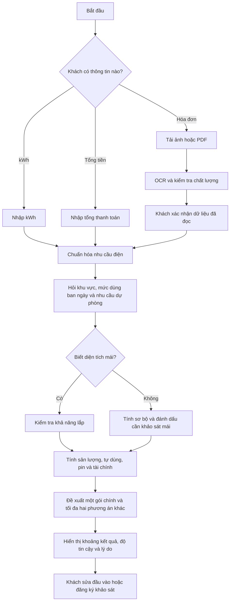

# Roadmap chuyên sâu — Công cụ tư vấn điện mặt trời cho khách hàng

## 1. Mục tiêu sản phẩm

Xây dựng một công cụ giúp khách hàng hộ gia đình nhận được phương án điện mặt
trời sơ bộ đáng tin cậy trong dưới 2 phút, kể cả khi khách hàng không am hiểu
công nghệ hoặc kỹ thuật điện.

Khách hàng chỉ cần bắt đầu bằng một trong ba cách:

1. Nhập số điện tiêu thụ theo `kWh`.
2. Nhập tổng tiền phải thanh toán trên hóa đơn.
3. Tải ảnh hoặc PDF hóa đơn để hệ thống đọc và yêu cầu xác nhận.

Kết quả phải trả lời rõ sáu câu hỏi:

- Nên lắp công suất bao nhiêu?
- Gói nào phù hợp nhất và vì sao?
- Cần bao nhiêu diện tích mái?
- Mỗi tháng có thể tiết kiệm trong khoảng nào?
- Hóa đơn sau khi lắp còn khoảng bao nhiêu?
- Thời gian hoàn vốn và mức điện dự phòng ước tính là bao nhiêu?

> Sản phẩm là công cụ **ước tính trước khảo sát**, không phải thiết kế kỹ thuật,
> cam kết sản lượng hoặc báo giá thi công cuối cùng.

## 2. Trạng thái xuất phát

MVP tại thời điểm bắt đầu roadmap có form khách hàng, biểu giá sinh hoạt 5 bậc, phép suy ngược tiền
điện thành kWh, bộ máy tính toán đơn giản, xếp hạng gói, giao diện kết quả, so
sánh gói và đăng ký khảo sát.

Các giới hạn xuất phát cần giải quyết qua từng giai đoạn:

- Chỉ nhận tiền điện **trước VAT**, trong khi khách hàng thường chỉ biết tổng tiền
  thanh toán.
- Chưa nhận kWh trực tiếp và chưa đọc hóa đơn.
- Sản lượng mới là `sản lượng nền × hệ số tỉnh`.
- Phụ tải ban ngày mới dùng ba tỷ lệ tổng quát.
- Pin lưu trữ chưa được mô phỏng theo thời gian và giới hạn vận hành.
- Dòng tiền chưa có suy giảm, bảo trì, tăng giá điện và thay thiết bị.
- Gói, hệ số tỉnh và nhiều giả định vẫn là dữ liệu demo.
- Chưa có bộ ca nghiệm thu độc lập đủ để cho phép phát hành chính thức.

Roadmap này thay thế định hướng cũ cho các giai đoạn tiếp theo. Phần quản trị đã
có được giữ nguyên nhưng **không nằm trong phạm vi phát triển**.

## 3. Phạm vi

### Trong phạm vi

- Hành trình khách hàng trên web và mobile.
- Nhập tiền, kWh hoặc hóa đơn.
- Chuẩn hóa hóa đơn, VAT và biểu giá sinh hoạt.
- Ước tính sản lượng 12 tháng.
- Ước tính phụ tải, tự dùng và điện dư.
- Mô phỏng pin lưu trữ và điện dự phòng ở mức tư vấn sơ bộ.
- Dòng tiền, hoàn vốn và khoảng bất định.
- Lọc, xếp hạng và giải thích lý do chọn gói.
- Mức độ tin cậy, nguồn dữ liệu và giả định công khai.
- Đăng ký khảo sát sau khi khách đã xem kết quả.
- Kiểm thử, hiệu chỉnh, bảo mật hóa đơn, accessibility và vận hành production.

### Ngoài phạm vi

- Phát triển thêm dashboard hoặc chức năng quản trị.
- CRM, phân quyền nhân viên và quy trình bán hàng nội bộ.
- Báo giá hoặc hợp đồng thi công tự động.
- Thiết kế điện một sợi, kiểm tra kết cấu mái hoặc hồ sơ đấu nối.
- Phân tích mái 3D, ảnh vệ tinh hoặc drone trong phiên bản này.
- Điều khiển inverter, pin hoặc thiết bị IoT.
- Cam kết sản lượng tuyệt đối hay tuyên bố “không sai số”.

## 4. Nguyên tắc không được thỏa hiệp

1. **Ít đầu vào:** không bắt khách nhập thông tin mà hệ thống có thể đọc hoặc suy
   ra an toàn.
2. **Xác nhận trước khi tính:** dữ liệu OCR không bao giờ được dùng âm thầm.
3. **Không tạo độ chính xác giả:** đầu vào càng thiếu, khoảng kết quả càng rộng và
   mức tin cậy càng thấp.
4. **Công thức xác định:** cùng input và cùng phiên bản dữ liệu phải trả cùng kết
   quả.
5. **Truy vết được:** mỗi kết quả lưu phiên bản biểu giá, sản lượng, gói và thuật
   toán đã dùng.
6. **Không dùng dữ liệu demo ở production:** thiếu dữ liệu đã duyệt thì trả trạng
   thái cần khảo sát, không tự thay bằng giá trị mẫu.
7. **Kết quả trước liên hệ:** không bắt số điện thoại để mở khóa kết quả.
8. **Bảo vệ hóa đơn:** chỉ lấy trường cần thiết, không lưu file gốc mặc định và
   không đưa dữ liệu cá nhân vào analytics.

## 5. Hành trình khách hàng mục tiêu



## 6. Kiến trúc mục tiêu

Giữ kiến trúc **modular monolith Next.js** hiện tại. Không tách microservice khi
chưa có nhu cầu mở rộng độc lập hoặc đội phát triển chuyên biệt.

### Các ranh giới nghiệp vụ

```text
Customer Input
  -> Bill/OCR Normalization
  -> Tariff Engine
  -> Load Profile Engine
  -> Solar Yield Engine
  -> Battery Dispatch Engine
  -> Financial Engine
  -> Package Eligibility + Recommendation
  -> Confidence + Explanation
  -> Customer Result
```

### Hợp đồng dữ liệu chuẩn

Mọi cách nhập phải được chuyển về một `NormalizedEnergyInput` thống nhất gồm:

- Nguồn đầu vào: `kwh`, `money` hoặc `invoice_ocr`.
- Kỳ hóa đơn và số ngày nếu biết.
- kWh đã xác nhận hoặc khoảng kWh ước tính.
- Tiền điện trước VAT, VAT, tổng thanh toán và khoản khác nếu có.
- Loại điện và phiên bản biểu giá.
- Trường nào do khách nhập, OCR đọc, hệ thống suy ra hoặc đang giả định.
- Confidence ở cấp từng trường.

Mỗi kết quả phải có `CalculationSnapshot` bất biến gồm:

- Input đã chuẩn hóa.
- Phiên bản thuật toán.
- Phiên bản biểu giá.
- Phiên bản dữ liệu sản lượng.
- Phiên bản gói sản phẩm.
- Toàn bộ giả định và cảnh báo.

## 7. Chiến lược phát hành

| Bản phát hành | Kết quả khách hàng nhận được | Giai đoạn | Điều kiện mở |
| --- | --- | --- | --- |
| R1 — Manual đáng tin cậy | Nhập kWh hoặc tổng tiền, tính đúng biểu giá/VAT | 0–2 | Biểu giá chính thức và test toán học đạt |
| R2 — Phương án cá nhân hóa | Sản lượng 12 tháng, phụ tải, pin và tài chính tốt hơn | 3–6 | Dữ liệu vùng, gói và giả định đã duyệt |
| R3 — Hóa đơn tự động | Tải hóa đơn, xác nhận và tính không cần gõ lại | 7 | Bộ hóa đơn ẩn danh đủ đại diện và privacy gate đạt |
| R4 — Public beta | Kết quả có confidence, giải thích và đã nghiệm thu | 8–9 | Golden cases, pilot và release gate đạt |

Ước lượng với một senior full-stack, một kỹ sư điện mặt trời tham gia bán thời
gian và một người product/QA bán thời gian: **12–16 tuần**. Nếu chưa có kỹ sư
duyệt dữ liệu hoặc bộ hóa đơn thật, tiến độ phải dừng ở cổng tương ứng thay vì
thay bằng giả định.

---

## 8. Các giai đoạn triển khai

## Giai đoạn 0 — Chốt hợp đồng sản phẩm và cổng dữ liệu

**Mục tiêu:** biến ranh giới “ước tính” thành quy tắc có thể kiểm tra trước khi
sửa sâu thuật toán.

> **Trạng thái triển khai 22/07/2026:** khung kỹ thuật đã hoàn thành: contract
> V2, provenance/confidence, trạng thái dữ liệu, fingerprint, snapshot bất biến,
> migration, cảnh báo DEMO và cổng production đều đã có test. Giai đoạn chưa thể
> đóng về nghiệp vụ vì biểu giá, package, sản lượng, tolerance và golden cases
> chưa được chuyên gia độc lập ký duyệt.

### Công việc

- [x] Gắn nhãn toàn bộ package, tỉnh và giả định hiện tại là `DEMO`.
- [x] Định nghĩa `NormalizedEnergyInput`, `CalculationSnapshot` và
  `ConfidenceLevel`.
- [x] Chốt ý nghĩa của tiền khách nhập: mặc định là **tổng tiền phải thanh toán**.
- [x] Chốt chính sách khi hóa đơn có phụ phí hoặc không đủ thông tin.
- [ ] Chốt nguồn dữ liệu, chủ sở hữu và ngày hiệu lực cho biểu giá, package và
  sản lượng.
- [x] Tạo bộ regression candidate ban đầu từ các biên biểu giá; chờ chuyên gia
  ký để nâng thành golden cases.
- [x] Ghi ngưỡng sai số kỹ thuật và ngưỡng nghiệp vụ đề xuất; chờ người có thẩm
  quyền phê duyệt ngưỡng nghiệp vụ.
- [x] Ghi `algorithmVersion` và `dataVersion` vào mọi kết quả mới.

### Đầu ra

- Hợp đồng dữ liệu V2.
- Ma trận nguồn dữ liệu và người phê duyệt.
- Bộ golden cases có kết quả kỳ vọng độc lập.
- Chính sách hiển thị ước tính, giả định và confidence.

### Điều kiện hoàn thành

- Không còn trường đầu vào hoặc kết quả có ý nghĩa mơ hồ.
- Mỗi dữ liệu ảnh hưởng kết quả có nguồn, phiên bản và trạng thái.
- Production có thể từ chối dữ liệu `DEMO` hoặc chưa duyệt.

## Giai đoạn 1 — Đầu vào tối giản và chuẩn hóa nhu cầu điện

**Mục tiêu:** khách hàng hoàn thành đầu vào thủ công trong dưới 60 giây.

**Trạng thái 22/07/2026:** phần kỹ thuật đã triển khai và có automated test.
Hai cổng usability cần người dùng thật vẫn chưa đo. Nhánh tổng tiền được nhận
đúng nghĩa nhưng chủ động chặn calculation cho tới khi Giai đoạn 2 có VAT/phụ
phí đã xác minh; tải hóa đơn chỉ là điểm nối chưa bật cho tới Giai đoạn 7.

### Công việc

- [x] Thêm bước chọn `Nhập kWh`, `Nhập tổng tiền` hoặc `Tải hóa đơn`.
- [x] Cho nhập một tháng hoặc trung bình tối đa 12 tháng; chỉ nâng confidence
  khi có ít nhất ba kỳ gần đây, liên tiếp và ghi rõ tháng.
- [x] Không yêu cầu loại điện vì hiện chỉ hỗ trợ hộ gia đình; hiển thị loại điện
  như một giả định có thể kiểm tra.
- [x] Đổi câu hỏi dùng điện ban ngày thành câu hỏi hành vi dễ hiểu, ví dụ nhà có
  người ở và dùng điều hòa/thiết bị trong 8:00–17:00 hay không.
- [x] Cho phép chọn `Không biết diện tích mái`; trường hợp này không được cam kết
  khả năng lắp.
- [x] Chỉ hỏi tải thiết yếu và số giờ khi khách chọn cần điện dự phòng.
- [x] Thêm màn hình tóm tắt dữ liệu để khách xác nhận trước khi tính.
- [x] Lưu provenance cho từng trường: khách nhập, suy ra hay mặc định.
- [x] Khi khách sửa input sau khi đã có kết quả, giữ kết quả cũ và hiển thị
  `Thông tin đã thay đổi — Cập nhật kết quả` thay vì xóa ngay lập tức.

### Điều kiện hoàn thành

- [ ] Tỷ lệ hoàn tất form trong usability test đạt ít nhất 85%.
- [ ] Thời gian trung vị hoàn tất input thủ công không quá 60 giây.
- [x] Không yêu cầu điện thoại trước khi xem kết quả.
- [x] Input kWh không đi qua phép suy ngược tiền điện.
- [x] Trường không biết không bị tự động biến thành một giá trị có vẻ chính xác.

Kịch bản và phiếu đo hai cổng còn lại nằm tại
[`docs/PHASE-1-USABILITY-TEST.md`](docs/PHASE-1-USABILITY-TEST.md).

## Giai đoạn 2 — Biểu giá, VAT và phép suy ngược hóa đơn chuẩn

**Mục tiêu:** tiền và kWh chuyển đổi đúng, có phiên bản và tái lập được.

**Trạng thái 22/07/2026:** phần kỹ thuật đã triển khai và có automated test.
Biểu giá hiện hành đã được sửa thành 6 bậc QD1279; cơ cấu 5 bậc trong ảnh được
giữ ở trạng thái candidate không thể chọn. Registry và VAT vẫn là `DRAFT /
requires_internal_approval`, vì vậy production tiếp tục chặn cho đến khi có
người duyệt, hash nội dung và hóa đơn EVN thật để đối soát làm tròn.

### Công việc

- [x] Chuyển biểu giá khỏi hằng số source thành bộ dữ liệu có mã phiên bản, ngày
  hiệu lực, VAT, tài liệu nguồn và trạng thái xác nhận.
- [x] Tách tiền điện năng, VAT và khoản khác; không coi toàn bộ tổng tiền là tiền
  điện trước VAT.
- [x] Hỗ trợ kỳ ghi điện khác số ngày chuẩn và quy tắc nhiều hộ/công tơ khi có căn
  cứ áp dụng.
- [x] Khi không biết phụ phí, trả khoảng kWh thay vì một số tuyệt đối.
- [x] Xây hàm `kWh -> hóa đơn` và `hóa đơn -> khoảng kWh` dùng cùng một tariff
  contract.
- [x] Kiểm thử toàn bộ điểm biên của từng bậc và ngày hiệu lực.
- [x] Hiển thị biểu giá, VAT, ngày hiệu lực và nguồn ngay trong “Cách tính”.
- [x] Buộc cả nhánh nhập kWh đi qua cổng phê duyệt biểu giá ở production; lịch
  sử nhiều phiên bản dùng biểu giá kỳ mới nhất cho phần dự phóng và ghi rõ trong
  snapshot.
- [x] Tự dọn calculation quá hạn chưa có lead (mặc định 30 ngày) và cung cấp
  lệnh để production chạy theo lịch.

### Điều kiện hoàn thành

- [x] Round-trip `kWh -> tiền -> kWh` sai lệch không quá `0,01 kWh` khi không có làm
  tròn hoặc khoản khác.
- [ ] Hóa đơn tham chiếu độc lập sai lệch không quá `1 VND` trước bước làm tròn
  quy định. Engineering golden cases đã đạt; còn cần hóa đơn EVN thật đã ẩn
  danh và người phụ trách ký duyệt.
- [x] 100% biên bậc, VAT và phiên bản biểu giá có automated test.
- [x] Biểu giá chưa hiệu lực, hết hiệu lực hoặc chưa duyệt không được dùng ở
  production; development/test chỉ được chạy có chủ đích và luôn mang nhãn
  chưa duyệt.

Hợp đồng, nguồn và checklist phê duyệt nằm tại
[`docs/PHASE-2-TARIFF-ENGINE.md`](docs/PHASE-2-TARIFF-ENGINE.md).

## Giai đoạn 3 — Sản lượng điện mặt trời 12 tháng

**Mục tiêu:** thay hệ số tỉnh đơn giản bằng mô hình sản lượng có mùa vụ và nguồn
kiểm chứng.

### Công việc

- [ ] Thu thập `kWh/kWp/tháng` cho các tỉnh thực sự phục vụ.
- [ ] Lưu nguồn, thời kỳ khí hậu, tọa độ và cấu hình mái tham chiếu.
- [ ] Tính ảnh hưởng của hướng mái, góc nghiêng và mức bóng che đơn giản.
- [ ] Tách tổn hao nhiệt độ, bụi, dây dẫn, inverter và khả dụng.
- [ ] Dùng hiệu suất/công suất thiết bị đúng package thay vì một hệ số chung.
- [ ] Trả sản lượng T1–T12, tổng năm và khoảng thấp–cao.
- [ ] Hạ confidence nếu khách không biết hướng, nghiêng, bóng che hoặc mái.
- [ ] Đối chiếu với PVsyst/PVGIS hoặc nguồn kỹ sư chấp thuận.

### Điều kiện hoàn thành

- Với cấu hình đã biết, tổng năm lệch không quá 5% so với bộ tham chiếu đã chọn.
- MAPE theo tháng không quá 8% trên tập mô phỏng tham chiếu.
- Cân bằng năng lượng và tổng 12 tháng khớp trong tolerance số học.
- Mọi sản lượng đều truy được về dataset và cấu hình mái đã dùng.

## Giai đoạn 4 — Phụ tải và mức tự dùng

**Mục tiêu:** ước tính đúng hơn phần điện mặt trời thực sự thay thế điện lưới.

### Công việc

- [ ] Xây các load profile hộ gia đình theo hành vi sử dụng ban ngày.
- [ ] Dùng lịch sử nhiều tháng để tạo seasonality nhu cầu khi khách cung cấp.
- [ ] Mô phỏng theo bước thời gian một giờ hoặc profile đại diện thay cho một tỷ
  lệ ban ngày duy nhất.
- [ ] Tách ngày thường/cuối tuần khi dữ liệu đủ hỗ trợ.
- [ ] Tính trực tiếp tự dùng, điện dư và điện mua lưới theo từng tháng.
- [ ] Trả khoảng rộng hơn khi chỉ có một hóa đơn và một câu hỏi hành vi.
- [ ] Hiệu chỉnh profile bằng hóa đơn ẩn danh hoặc dữ liệu công tơ nếu có.

### Điều kiện hoàn thành

- Không có năng lượng tự dùng lớn hơn sản lượng hoặc nhu cầu.
- Điện mua lưới, tự dùng và điện dư bảo toàn năng lượng trong tolerance
  `0,01 kWh`.
- Các trường hợp thấp/vừa/cao có kết quả được kỹ sư giải thích và phê duyệt.
- Kết quả nêu rõ profile đo thực tế hay profile suy đoán.

## Giai đoạn 5 — Pin lưu trữ và điện dự phòng

**Mục tiêu:** không dùng dung lượng danh định để hứa thời gian dự phòng thiếu căn
cứ.

### Công việc

- [ ] Dùng dung lượng khả dụng, DoD, SOC tối thiểu và hiệu suất nạp/xả.
- [ ] Giới hạn công suất nạp/xả theo pin và inverter.
- [ ] Mô phỏng SOC theo thời gian, không giả định một chu kỳ đầy đủ mỗi ngày.
- [ ] Tách hai mục tiêu: tối ưu tiền điện và dành pin cho mất điện.
- [ ] Hỏi tải thiết yếu hoặc nhóm thiết bị và số giờ mong muốn khi cần backup.
- [ ] Trả thời gian dự phòng theo khoảng cùng danh sách tải giả định.
- [ ] Đưa suy giảm pin và lịch thay pin vào kết quả dài hạn.

### Điều kiện hoàn thành

- SOC luôn nằm trong giới hạn; pin không tạo năng lượng và không xả quá công suất.
- Không dùng điện mặt trời dư hai lần cho tự dùng và sạc pin.
- Thời gian backup được nghiệm thu trên ca tải thấp, trung bình, cao và ngày ít
  nắng.
- Nếu thiếu tải thiết yếu, kết quả chỉ ghi “cần khảo sát”, không hiển thị số giờ
  chắc chắn.

## Giai đoạn 6 — Tài chính và đề xuất gói có thể giải thích

**Mục tiêu:** đề xuất gói theo ràng buộc thực tế và lợi ích khách hàng, không dựa
trên điểm số demo khó kiểm chứng.

### Công việc

- [ ] Chuẩn hóa giá gói, VAT, hạng mục gồm/không gồm và ngày hiệu lực.
- [ ] Tính suy giảm tấm pin, O&M, vệ sinh, tăng giá điện và thay inverter/pin.
- [ ] Tính simple payback; bổ sung discounted payback và NPV khi discount rate đã
  được duyệt; chỉ hiển thị IRR khi dòng tiền đáp ứng điều kiện tính hợp lệ.
- [ ] Chỉ ghi nhận doanh thu điện dư khi có căn cứ pháp lý còn hiệu lực; mặc định
  bằng 0 nếu chưa chắc chắn.
- [ ] Lọc cứng theo mái, pha điện, công suất inverter, backup và tính tương thích
  thiết bị trước khi xếp hạng.
- [ ] Xếp hạng theo nhu cầu được đáp ứng, tiết kiệm, tự dùng, hoàn vốn và độ tin
  cậy; mọi trọng số phải có ca nghiệm thu.
- [ ] Trả một gói chính, tối đa hai phương án khác và lý do chọn/loại.
- [ ] Trả `no safe recommendation` khi không có gói đủ dữ liệu hoặc đủ điều kiện.
- [ ] Thay hai hệ số thấp/cao cố định bằng khoảng P50/P90 hoặc khoảng
  thận trọng–kỳ vọng được hiệu chỉnh từ bất định của sản lượng, mái và phụ tải.

### Điều kiện hoàn thành

- Dòng tiền khớp mô hình tham chiếu trong tolerance đã chốt.
- NPV/IRR khớp workbook độc lập trong `0,1%` hoặc `0,1 điểm phần trăm` tùy chỉ số.
- Gói đã hết hạn, thiếu giá hoặc chưa xác minh không được đề xuất.
- Gói hệ thống chọn trùng lựa chọn kỹ sư ở ít nhất 90% golden cases; các ca còn
  lại phải có giải thích và được xem xét.
- Top-3 chứa lựa chọn kỹ sư ở 100% golden cases đủ dữ liệu.
- Khi có tập backtest đủ lớn, khoảng P90 bao phủ kết quả tham chiếu trong
  85–95%; nếu chưa đủ dữ liệu phải ghi rõ đây là biên kịch bản, không phải P90.
- Thay đổi một giả định phải tạo snapshot/version mới, không sửa lịch sử.

## Giai đoạn 7 — OCR hóa đơn có bước xác nhận

**Mục tiêu:** giảm thao tác nhập nhưng không hy sinh độ chính xác và quyền riêng
tư.

### Công việc

- [ ] Hỗ trợ JPG, PNG và PDF với giới hạn dung lượng, số trang và MIME thực tế.
- [ ] Kiểm tra ảnh mờ, thiếu góc, lóa hoặc không phải hóa đơn điện trước khi OCR.
- [ ] Trích xuất kỳ hóa đơn, số ngày, kWh, tiền trước VAT, VAT, tổng thanh toán,
  loại điện và mã khu vực nếu có.
- [ ] Gắn confidence cho từng trường, không chỉ một điểm chung cho cả hóa đơn.
- [ ] Hiển thị màn hình xác nhận; tô rõ trường không chắc chắn và cho sửa nhanh.
- [ ] Không đưa tên, địa chỉ, mã khách hàng hoặc số công tơ vào calculation nếu
  không cần thiết.
- [ ] Xóa file gốc ngay sau trích xuất hoặc tối đa trong 24 giờ theo chính sách đã
  công bố; chỉ lưu lâu hơn khi có đồng ý rõ ràng.
- [ ] Luôn có đường lui nhập kWh hoặc tổng tiền thủ công.

### Điều kiện hoàn thành

- Trên tập hóa đơn được hỗ trợ và đủ rõ, độ chính xác từng trường quan trọng
  `kWh`, `tổng tiền`, `kỳ hóa đơn` đạt ít nhất 95%.
- 100% dữ liệu OCR phải qua màn hình xác nhận trước calculation.
- File lỗi, quá lớn hoặc không hỗ trợ không làm hỏng phiên và có hướng dẫn sửa.
- Không có PII trong log, analytics, URL hoặc thông báo lỗi.

## Giai đoạn 8 — Giao diện kết quả tạo lòng tin

**Mục tiêu:** khách hiểu phương án trong 30 giây trước khi xem chi tiết kỹ thuật.

### Công việc

- [ ] Đưa một gói đề xuất lên đầu với giá, công suất, mái cần, tiết kiệm/tháng,
  hóa đơn còn lại và hoàn vốn theo khoảng.
- [ ] Hiển thị ba lý do cụ thể “Vì sao chọn gói này”.
- [ ] Hiển thị mức tin cậy và hành động giúp tăng độ tin cậy.
- [ ] Tách rõ `Khách đã cung cấp`, `Hệ thống suy ra` và `Đang giả định`.
- [ ] Cho sửa một đầu vào và tính lại mà không nhập lại toàn bộ form.
- [ ] Đưa công thức, biểu giá, nguồn và phiên bản vào mục “Xem cách tính”.
- [ ] Giữ so sánh tối đa ba gói nhưng ưu tiên ngôn ngữ dễ hiểu hơn điểm kỹ thuật.
- [ ] Đặt form khảo sát sau kết quả; gửi kèm snapshot khách vừa xem.
- [ ] Khi khách chọn phương án khác, KPI, thiết bị và gói gửi trong yêu cầu khảo
  sát phải cùng chuyển sang phương án khách đang xem.
- [ ] Cung cấp bản tóm tắt dạng chữ/bảng tương đương cho mọi biểu đồ.
- [ ] Hoàn thiện mobile, keyboard, screen reader, contrast và reduced motion.
- [ ] Sửa semantics `fieldset/legend`, ID trợ giúp trùng và liên kết lỗi–input.
- [ ] Đo funnel theo nguồn nhập mà không thu PII: chọn cách nhập, hoàn tất input,
  OCR thành công/thất bại/được sửa, xem kết quả, mở giả định và gửi khảo sát.

### Điều kiện hoàn thành

- Ít nhất 80% người dùng thử trả lời đúng gói nào được đề xuất, tiết kiệm trong
  khoảng nào và vì sao đây chỉ là ước tính.
- Không có nội dung tràn ngang ở viewport 320 px.
- Luồng chính đạt WCAG 2.2 AA và dùng được hoàn toàn bằng bàn phím.
- Calculation thành công có p95 dưới 2 giây, không tính thời gian OCR.
- Không có PII trong analytics và sự kiện chỉ được ghi khi hành động thực sự xảy
  ra, không ghi chỉ vì component được render.

## Giai đoạn 9 — Hiệu chỉnh, pilot và phát hành

**Mục tiêu:** chỉ mở cho khách hàng thật sau khi toán học, nghiệp vụ và trải
nghiệm cùng đạt.

### Công việc

- [ ] Có tối thiểu 10 ca nghiệm thu kỹ sư; mục tiêu 30–50 ca trước khi mở rộng.
- [ ] Bao phủ hóa đơn thấp–cao, vùng nắng khác nhau, mái thuận lợi/bất lợi, dùng
  ngày/đêm và hòa lưới/hybrid.
- [ ] Đối chiếu sản lượng với công cụ kỹ thuật và hệ thống đang vận hành khi có.
- [ ] Chạy shadow mode: ứng dụng tính nhưng kỹ sư vẫn quyết định độc lập.
- [ ] Ghi chênh lệch theo lớp: hóa đơn, sản lượng, tự dùng, pin, tài chính và gói.
- [ ] Hiệu chỉnh bằng tập train/calibration và đánh giá bằng tập holdout riêng.
- [ ] Thực hiện usability test với ít nhất 5–8 khách hàng mục tiêu.
- [ ] Kiểm tra bảo mật upload, privacy, accessibility, tải và phục hồi lỗi.
- [ ] Mở public beta có giới hạn và cơ chế quay lại phiên bản trước.

### Điều kiện hoàn thành

- 100% ca P0/P1 đạt; không còn lỗi có thể làm sai gói hoặc sai tiền nghiêm trọng.
- Sai số hóa đơn nằm trong tolerance của tariff engine.
- Sản lượng và recommendation đạt ngưỡng Giai đoạn 3 và 6 trên holdout set.
- Không có dữ liệu demo hoặc chưa duyệt trong kết quả public.
- Có cảnh báo, version, nguồn và confidence trên mọi kết quả.
- Có người chịu trách nhiệm ký duyệt phát hành về kỹ thuật, sản phẩm và dữ liệu.

---

## 9. Luồng dữ liệu bắt buộc chạy song song

| Dữ liệu | Mức tối thiểu | Cần trước | Cổng chất lượng |
| --- | --- | --- | --- |
| Biểu giá sinh hoạt | Đủ bậc, VAT, hiệu lực, văn bản | Giai đoạn 2 | Người phụ trách xác nhận |
| Gói sản phẩm | Mọi gói đang bán, giá và cấu hình | Giai đoạn 6 | Giá còn hiệu lực, SKU khớp |
| Thiết bị | Datasheet, hiệu suất, bảo hành, giới hạn | Giai đoạn 3/5 | Kỹ sư xác minh model |
| Sản lượng khu vực | T1–T12 cho khu vực phục vụ | Giai đoạn 3 | Nguồn mô phỏng/đo và cấu hình rõ |
| Load profile | Profile đại diện hoặc dữ liệu đo | Giai đoạn 4 | Tổng profile = tổng nhu cầu |
| Giả định tài chính | O&M, suy giảm, thay thế, discount | Giai đoạn 6 | Đơn vị và tỷ lệ chuẩn hóa |
| Hóa đơn OCR | Tập ẩn danh theo các mẫu hỗ trợ | Giai đoạn 7 | Có ground truth từng trường |
| Ca nghiệm thu | Tối thiểu 10, mục tiêu 30–50 | Giai đoạn 9 | Kỹ sư duyệt độc lập |

Thu thập dữ liệu phải bắt đầu từ Giai đoạn 0. Không chờ làm xong giao diện mới
yêu cầu dữ liệu vì đây là đường găng của dự án.

Bộ dữ liệu nghiệm thu nên có tối thiểu:

- 30–50 hóa đơn ẩn danh, bao phủ các mức dùng và biên biểu giá.
- 20 cấu hình PV tham chiếu theo vùng, hướng và góc nghiêng.
- 20 kịch bản load/battery có bảng năng lượng theo giờ.
- 10 ca end-to-end do kỹ sư tính độc lập.
- Khi có thể, 10 hệ thống đang vận hành với 6–12 tháng dữ liệu đo để hiệu chỉnh
  khoảng tin cậy.

Tập dùng để hiệu chỉnh và tập dùng để nghiệm thu phải tách riêng.

## 10. Ma trận kiểm thử

| Lớp | Kiểm thử bắt buộc |
| --- | --- |
| Input | Tiền/kWh/OCR, số âm, cực trị, thiếu dữ liệu, nhiều tháng, không biết mái |
| Tariff | Mọi biên bậc, VAT, làm tròn, hiệu lực, inverse/forward, khoản khác |
| Yield | 12 tháng, hướng/nghiêng, bóng che, loss, dataset version, tổng năm |
| Load | Profile thấp/vừa/cao, seasonality, bảo toàn năng lượng |
| Battery | SOC, DoD, hiệu suất, power limit, reserve, ngày ít nắng, không tạo điện |
| Finance | O&M, degradation, escalation, replacement, NPV, zero saving |
| Recommendation | Mái, pha, backup, package hết hạn, no-match, tie-break |
| OCR | Mờ, xoay, nhiều trang, sai định dạng, confidence thấp, sửa thủ công |
| UI | Mobile, keyboard, screen reader, loading/error/retry, sửa và tính lại |
| Snapshot | Tái lập đúng kết quả từ input và toàn bộ phiên bản đã lưu |

Ngoài test ví dụ, bổ sung property-based tests cho tariff và energy balance;
regression tests cho mỗi lỗi production; golden tests cho các ca kỹ sư duyệt.

## 11. Cổng phát hành bắt buộc

### Gate A — Mathematical correctness

- Tariff round-trip đạt tolerance.
- Mọi mô hình bảo toàn năng lượng.
- Không NaN, số âm ngoài ý nghĩa hoặc chia cho 0.
- Cùng snapshot luôn tái lập cùng kết quả.

### Gate B — Domain validity

- Kỹ sư duyệt nguồn sản lượng, thiết bị, pin và ca nghiệm thu.
- Package và biểu giá còn hiệu lực.
- Recommendation đạt ngưỡng golden/holdout cases.

### Gate C — Customer safety and trust

- Không dùng dữ liệu demo hoặc OCR chưa xác nhận.
- Khoảng kết quả và confidence hiển thị đúng.
- Cảnh báo khảo sát không bị ẩn sau CTA.
- Không tuyên bố tiết kiệm hoặc sản lượng được bảo đảm.

### Gate D — Privacy, accessibility and reliability

- PII không xuất hiện trong log/analytics.
- File hóa đơn được xóa theo chính sách.
- Luồng chính đạt WCAG 2.2 AA.
- Error rate, p95 latency, retry và rollback đạt yêu cầu vận hành.

## 12. KPI sản phẩm

### Độ chính xác và tin cậy

- 100% kết quả có algorithm/data version.
- 100% trường suy đoán được đánh dấu là giả định.
- Recommendation khớp kỹ sư ít nhất 90% trên holdout set.
- 0 kết quả public sử dụng dữ liệu `DEMO` hoặc hết hiệu lực.

### Trải nghiệm

- Tỷ lệ hoàn tất calculation ít nhất 85% với người đã bắt đầu.
- Thời gian trung vị nhập thủ công không quá 60 giây.
- OCR được khách xác nhận trong không quá 30 giây ở trường hợp thành công.
- Ít nhất 80% người dùng thử hiểu đúng kết quả và giới hạn của ước tính.

### Kỹ thuật

- Calculation API success rate tối thiểu 99,5%.
- p95 calculation dưới 2 giây; p95 OCR mục tiêu dưới 10 giây.
- Không có lỗi P0/P1 mở tại thời điểm phát hành.
- Trang không OCR hướng tới Core Web Vitals mobile: LCP p75 không quá 2,5 giây,
  INP không quá 200 ms và CLS không quá 0,1.

### Chuyển đổi có đạo đức

- Theo dõi tỷ lệ xem kết quả, mở cách tính, sửa input và đăng ký khảo sát.
- Không tối ưu conversion bằng cách giấu giả định, ép số điện thoại hoặc phóng đại
  tiết kiệm.

## 13. Rủi ro chính và cách kiểm soát

| Rủi ro | Hậu quả | Kiểm soát |
| --- | --- | --- |
| Biểu giá thay đổi | Sai kWh và tiết kiệm | Version, hiệu lực, regression và khóa bản hết hạn |
| Tổng tiền có phụ phí | Suy ngược kWh quá cao | Tách khoản khác hoặc trả khoảng |
| Chỉ có một tháng dữ liệu | Bỏ qua mùa vụ | Khuyến khích 3–12 tháng, mở rộng confidence band |
| Khách không biết mái | Đề xuất gói không lắp được | Không hard-pass roof; đánh dấu cần khảo sát |
| Load profile không đúng | Sai tự dùng và pin | Profile theo hành vi, hiệu chỉnh, khoảng bất định |
| Dữ liệu sản lượng thiếu | Sai sản lượng theo vùng | Chỉ mở khu vực đã duyệt; không dùng hệ số “khác” demo |
| OCR đọc nhầm | Sai toàn bộ calculation | Confidence từng trường và xác nhận bắt buộc |
| Giá/package hết hạn | Tư vấn sai thương mại | Validity gate và snapshot phiên bản |
| Điện dư chưa có cơ chế chắc chắn | Phóng đại hoàn vốn | Giá trị mặc định bằng 0 nếu chưa có căn cứ |
| Thiếu chuyên gia nghiệm thu | Test pass nhưng sai nghiệp vụ | Bắt buộc domain sign-off trước beta |

## 14. Thứ tự thực hiện không được đảo

1. Chốt hợp đồng dữ liệu và bộ nghiệm thu.
2. Hoàn thiện nhập kWh/tổng tiền và biểu giá/VAT.
3. Hoàn thiện sản lượng 12 tháng.
4. Hoàn thiện phụ tải và tự dùng.
5. Hoàn thiện pin và backup.
6. Hoàn thiện tài chính và recommendation.
7. Thêm OCR trên cùng input chuẩn hóa.
8. Tối ưu giao diện kết quả và giải thích.
9. Hiệu chỉnh bằng dữ liệu thật, pilot rồi mới public beta.

Không nên làm OCR trước khi hợp đồng input và tariff engine ổn định; nếu không,
OCR chỉ tự động đưa dữ liệu vào một phép tính chưa đủ chính xác.

## 15. Definition of Done toàn dự án

Dự án chỉ được xem là hoàn thành cho khách hàng khi:

- Khách nhập được kWh, tổng tiền hoặc hóa đơn và luôn xác nhận dữ liệu cuối.
- Hệ thống tính đúng biểu giá/VAT theo phiên bản có hiệu lực.
- Sản lượng, tự dùng, pin và dòng tiền qua nghiệm thu độc lập.
- Không có package hoặc giả định demo trong kết quả.
- Kết quả giải thích được vì sao chọn gói và vì sao có khoảng sai số.
- Khách không biết kỹ thuật vẫn hoàn thành được trên mobile.
- Mọi snapshot có thể tái lập và phục vụ xử lý khiếu nại.
- Privacy, accessibility, reliability và rollback gate đều đạt.
- Kỹ sư điện mặt trời và người chịu trách nhiệm sản phẩm ký duyệt public beta.

## 16. Kiểm tra kỹ thuật sau mỗi giai đoạn

```bash
npm run lint
npm run type-check
npm run test:run
npm run build
```

Mỗi giai đoạn phải bổ sung test đúng lớp vừa thay đổi, cập nhật tài liệu công thức
và ghi lại version nếu kết quả calculation thay đổi.
